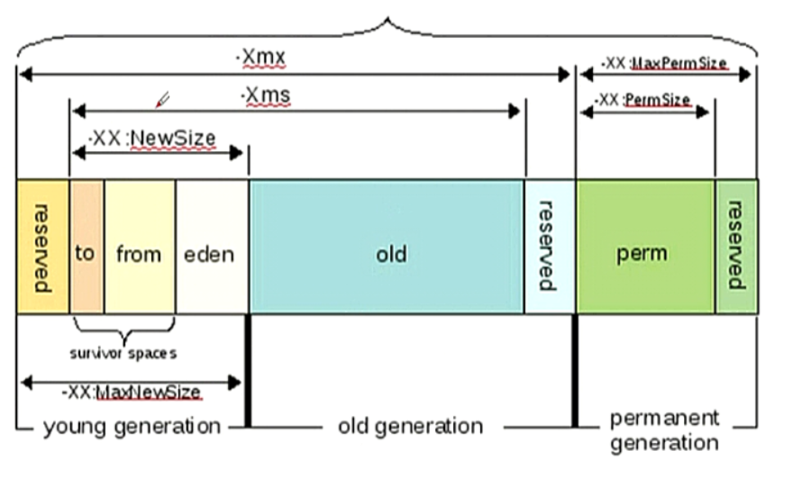

#### 测试环境：Tomcat8，以下的变量定义添加在catalina.sh的96行之下（具体百度）
```
# 变量说明：
# $JAVA_OPTS：     仅对启动运行Tomcat实例的Java虚拟机有效
# $CATALINA_OPTS： 对本机上的所有Java虚拟机有效

JAVA_OPTS="
$JAVA_OPTS
-server 
-Xms256M
-Xmx512M
-Xss1M
-Djava.awt.headless=true 
-Dfile.encoding=UTF-8
-Duser.country=CN
-Duser.timezone=Asia/Shanghai
-XX:MinHeapFreeRatio=80 
-XX:MaxHeapFreeRatio=80 
-XX:ThreadStackSize=512
-XX:NewSize=256m
-XX:NewRatio=4 
-XX:SurvivorRatio=8
-XX:+AggressiveOpts"

#或，使用环境变量的方式调整：export $CATALINA_OPTS="-Xmx256m ......"
```


