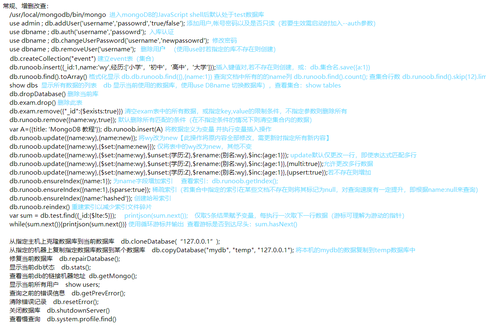

#### 备忘
```txt
是使用C++语言开发的开源软件，可在高负载时添加更多节点来保证服务器性能，旨在为WEB应用提供可扩展的高性能数据存储解决方案
mongodb使用javascript的语法进行操作，在其集合中的每个文档都可有自己独特的结构，是树形结构数据库，而传统数据库关联复杂
MongoDB将数据存储为"文档"，数据结构由 key:value 组成，"文档"类似于JSON对象。字段值可包含其他文档，无结构限制且可嵌套
单个实例可容纳多个独立数据库，每个数据库均有属于自己的集合和权限，不同的数据库也放置在不同的文件中
默认的数据库为"db"（存在data目录内）单个实例可容纳多个独立数据库，每个都有自己的集合和权限，不同的库可放置在不同文件
当数据量很大时需用到分片：将数据分若干份（称分段或分片）存于不同服务器，可将大型的集合分割保存到不同节点内
与其他的方案相比MongoDB的分片几乎能自动为我们完成所有事（自动分片）...
只要简单配置并告诉MongoDB要分配的数据即可自动维护数据在不同服务器之间的平衡。同时根据需增减设备时也会自动转移数据...

保留库：
    admin：  从权限角度看是"root"。将用户添加到此库则其继承所有库权限。特定服务端命令只能从此库运行，如列所有库或关闭服务
    local：  存储仅限于本地单台服务器的任意集合 （永不被复制）
    config： 当用于分片设置时此库在内部使用（保存分片相关信息 ）

添加用户：	 db.addUser('name','pass','true/false'); #帐号密码以及是否只读（若要生效需启动时加入--auth选项）
删除用户：	 use dbname ; db.removeUser('username'); #若在adimin库中添加用户则是超级管理员权限
修改密码：	 use dbname ; db.changeUserPassword('username','passowrd');
入库认证：	 use dbname ; db.auth('username','passowrd');
```
#### mongoexport & mongoimport ： 导出与导入
```txt
#导入/导出可以是本地也可以是远程服务器
#在本地执行导出远程mongodb服务器的数据：
    mongoexport：    mongoimport：
    -d	  库         -type [csv/json] #默认json
    -c	  集合       -file            #文件路径
    -f	  列名       -f	  	      #导入的数据存于哪些列
    -q	  条件       --headrline      #跳过第一行
    -o    导出名				
    --csv EXCEl

导出：mongoexport -d 库名 -c 集合 -f 列1，列2 -q '{name:{$lte:1000}}' -o ./dump.json
导入：mongoimport -d 库名 -c 集合 --type csv --headrline -f 列1，列2 --file ./dump.csv

二进制导出：mongodump -d 库 [-c 表] -f 列1,列2  #默认导出到mongo的dump目录（包括数据及索引信息）
二进制导入：mondorestore -d 库 --directoryperdb dump/库  #--directoryperdb指定备份的二进制文件所在路径
```
#### mongod 服务启动时参数
```txt
************************************* 基本配置 *********************************************
--quiet         	# 安静输出
--port arg      	# 指定服务端口号，默认端口27017
--bind_ip arg   	# 绑定服务IP，若绑定127.0.0.1，则只能本机访问，不指定默认本地所有IP
--logpath arg   	# 指定MongoDB日志文件，注意是指定文件不是目录
--logappend     	# 使用追加的方式写日志
--keyFile arg   	# 集群的私钥的完整路径，只对于Replica Set 架构有效
--unixSocketPrefix arg  # UNIX域套接字替代目录（默认 /tmp）禁用Unix套接字监听：--nounixsocket
--pidfilepath arg       # PID File 的完整路径，如果没有设置，则没有PID文件
--fork          	# 以守护进程的方式运行MongoDB （运行在后台）
--auth          	# 启用验证（不启用验证 --noauth ）
--cpu           	# 定期显示CPU的CPU利用率和iowait
--dbpath arg    	# 指定数据库路径
--diaglog arg   	# diaglog选项 0=off 1=W 2=R 3=both 7=W+some reads
--maxConns arg  	# 最大并发连接数 默认2000
--httpinterface		# 启用HTTP接口（提供使用 restful API 的方式来监控服务的运行状态）
--jsonp         	# 允许JSONP形式通过HTTP访问（有安全影响）
--noprealloc    	# 禁用数据文件预分配(往往影响性能)
--noscripting   	# 禁用脚本引擎
--notablescan   	# 不允许表扫描
--nssize arg (=16)  	# 设置信数据库.ns文件大小(MB)
--objcheck      	# 在收到客户数据，检查的有效性
--profile arg   	# 档案参数 0=off 1=slow, 2=all
--quota         	# 限制每个数据库的文件数，设置默认为8
--rest          	# 开启简单的rest API
--repair        	# 修复所有数据库run repair on all dbs
--smallfiles    	# 使用较小的默认文件
--sysinfo       	# 打印一些诊断系统信息
--upgrade       	# 如果需要升级数据库
--syncdelay arg (=60)   # 数据写入磁盘的时间秒数(0=never,不推荐)
--journal           	# 启用日志选项，MongoDB的数据操作将会写入到journal文件夹的文件里
--journalOptions arg    # 启用日志诊断选项
--repairpath arg    	# 修复库生成的文件的目录,默认为目录名称dbpath
--slowms arg (=100) 	# 定义超过多长时间的命令成为慢查询 value of slow for profile and console log
--quotaFiles arg    	# number of files allower per db, requires --quota
--nohttpinterface   	# 关闭http接口，默认关闭27018端口访问
--directoryperdb    	# 设置每个数据库将被保存在一个单独的目录
--ipv6          	# 启用IPv6选项

******************************** Replicaton **************************************************
--fastsync      	# 从一个dbpath里启用从库复制服务，该dbpath的数据库是主库的快照，可用于快速启用同步
--autoresync    	# 如果从库与主库同步数据差得多，自动重新同步，
--oplogSize arg 	# 设置oplog的大小(MB)

******************************** 主/从参数 ****************************************************
--master        	# 主库模式
--slave         	# 从库模式
--source arg    	# 从库 端口号
--only arg      	# 指定单一的数据库复制
--slavedelay arg    	# 设置从库同步主库的延迟时间

********************************* Replica set(副本集)选项 ************************************
--replSet arg   	# 设置副本集名称

******************************** Sharding(分片)选项 ******************************************
--configsvr         	# 声明这是一个集群的config服务,默认端口27019，默认目录/data/configdb
--shardsvr          	# 声明这是一个集群的分片,默认端口27018
--noMoveParanoia    	# 关闭偏执为moveChunk数据保存

********************************************************************************************
# 上述参数都可写入 mongod.conf 配置档，如：
dbpath = /data/mongodb
logpath = /data/mongodb/mongodb.log
logappend = true
port = 27017
fork = true
auth = true
```
#### 数据库账户的创建与认证
```javascript
#验证：mongo -u mongo_admin -p mongo_passowrd --authenticationDatabase <db_name>
> db.createUser( { "user": "mongo_admin",                                                 #创建用户
...                "pwd": "mongo_passowrd", "customData" : { employeeId: 12345 },         #
...                "roles" : [ { role: "root", db: "admin" },"readWrite" ] } )            #
Successfully added user: {
        "user" : "mongo_admin",
        "customData" : {
                "employeeId" : 12345
        },
        "roles" : [
                {
                        "role" : "root",
                        "db" : "admin"
                },
                "readWrite"
        ]
}

> use admin                                       #
switched to db admin                              #
> db.auth("mongo_admin","mongo_passowrd")         #入库认证
1                                                 #
                                                  #

```
#### mongo shell
```javascript

> db.version()
2.6.12
> show dbs                                  #查看所有数据库
admin  (empty)              
local  0.078GB              
> use admin;                                #使用特定数据库
switched to db admin
> use admin;
switched to db admin
> show collections;                         #显示当前数据库中的集合
system.indexes      
system.users        
system.version      
> show users;                               #显示用户
> db.foo.find( { a : 1 } )                  #查找当前数据库的foo集合下属性a的值为1的对象
> db.stats();                               #显示当前db状态
{
        "db" : "admin",
        "collections" : 4,
        "objects" : 12,
        "avgObjSize" : 117.33333333333333,
        "dataSize" : 1408,
        "storageSize" : 32768,
        "numExtents" : 4,
        "indexes" : 3,
        "indexSize" : 24528,
        "fileSize" : 67108864,
        "nsSizeMB" : 16,
        "dataFileVersion" : {
                "major" : 4,
                "minor" : 5
        },
        "extentFreeList" : {
                "num" : 0,
                "totalSize" : 0
        },
        "ok" : 1
}

> db.getName();                                 #查看当前使用的数据库
> db.dropDatabase();                            #删除当前使用数据库
> db.cloneDatabase(“127.0.0.1”);                #将指定机器上的数据库的数据克隆到当前库
        
> db.help();                                    #输出数据库相关的子命令及帮助 / object.help()
DB methods:
   db.adminCommand(nameOrDocument) - switches to 'admin' db, and runs comman..........
   db.auth(username, password)
   db.cloneDatabase(fromhost)
   db.commandHelp(name) returns the help for the command
   db.copyDatabase(fromdb, todb, fromhost)
   ..............(略)


db.exam.remove({"_id":{$exists:true}});         #清空exam 表中的所有数据
db.exam.find();                                 #查找exam表中的20条记录
db.exam.find().limit(10);                       #查找exam表中的10条记录    
db.exam.drop();                                 #删除此表
db.exam.remove({});                             #清空exam 表中的所有数据  
db.createCollection("event");                   #建立 event 表        

> db.集合名.save({a:1});                 #插入
> show dbs;                             #显示所有库及其容量
> show tables;                          #查看表（集合）
> db.dropDatabase();                    #删除当前库
> use runoob;                           #连到指定库（若不存在则创建，若库内无键值则不予显示需向其中插入数据后查看）
> db                                    #显示当前库对象或集合
> db.集合名.insert({"n":"1"})
> db.集合名.insert(                     #插入文档（若集合不存在则直接创建）
{	title: 'MongoDB 教程', 	
	description: 'MongoDB是一个Nosql数据库，此段信息存储在runoob库的col集合中',
	by: '菜鸟教程',
	url: 'http://www.runoob.com',
	tags: ['mongodb', 'database', 'NoSQL'],
	likes: 100
});
> 变量名=({title: 'MongoDB 教程'});                          #也可将数据定义为变量
> db.集合.insert(变量名)                                     #执行变量插入操作
> db.集合.insert({_id:1,name:wy});					#增一篇
> db.集合.insert([{_id:2,name:wy1},{_id:3,name:wy2},{_id:4,name=wy3}]);   #增多篇（使用数组的形式）
> db.集合.insert({_id:1,name:wy,经历:[小学，初中，高中，大学]});            #增嵌套（文档可任意深度）
> db.集合.remove({name:wy});                                      #删除指定表中名字为wy的文档
> db.集合.remove();                                               #删除所有
> db.集合.remove({name:wy,true});                                 #默认删除所有匹配的条件
> db.集合.update({name:wy},{name:new});                           #将wy改为new【此操作将原内容全部修改，需更新时指定所有新内容】
> db.集合.update({name:wy},{$set:{name:new}});                    #仅将表中的wy改为new，其他不变
> db.集合.find().count();                                         #查看集合内行数

$set:{}                 #修改某列的值
$unset:{}		#删除某列的值
$rename:{}		#修改列名
$incr:{}		#增长
		
#update默认仅更改一行，即使表达式匹配多行：
db.集合名.update({name:wy},{$set:{name:宇},$unset:{学历:专},$rename:{别名:wy},$inc:{age:1}});	
#允许更改多行数据
db.集合名.update({name:wy},{$set:{name:宇},$unset:{学历:专},$rename:{别名:wy},$inc:{age:1}},{multi:true});
#若不存在则增加		
db.集合名.update({name:wy},{$set:{name:宇},$unset:{学历:专},$rename:{别名:wy},$inc:{age:1}},{upsert:true});		
```
#### mongotop 命令
```bash
#可查看MongoDB实例花销在读或写上的时间，它提供集合级别的统计数据，而mongostat提供数据库级别的统计数据。默认每秒刷新/次

--help          显示帮助信息
--verbose,-v    详细模式，多个v越详细，如-vvv
--version       显示版本信息
--host          指定主机名
--port          指定端口
--username,-u   指定用户名
--password,-p   指定用户密码
--authenticationDatabase    指定用户凭证的库名
--authenticationMechanism   指定认证机制
--locks         根据每个库显示，而不是根据集合显示
<sleeptime>     刷新间隔时间

[root@localhost ~]# mongotop --port 28018  15       #ns即namespace，由库名和集合名构成  
connected to: 127.0.0.1:28018
                                           ns       total        read       write      2014-10-08T06:43:38
               game_server_jd23.player_message       198ms       138ms        60ms
              game_server_jd33.player_instance       173ms       125ms        48ms
              game_server_jd02.player_backpack       132ms       126ms        6ms
              game_server_jd03.player_backpack       117ms       115ms        2ms
                                local.oplog.rs       112ms       112ms        0ms
               game_server_jd02.player_message       103ms       103ms        0ms
              game_server_jd12.player_backpack        82ms        63ms        19ms
           game_server_jd678new.player_message        80ms        80ms        0ms
              game_server_jd22.player_backpack        68ms        66ms        2ms
```
#### mongostat 命令
```bash
#mongostat是mongdb自带的状态检测工具，其间隔固定时间获取mongodb当前运行状态。
#若发现数据库突然变慢或者有其他问题的话第一手操作就考虑采用mongostat来查看状态

inserts/s   每秒插入次数
query/s     每秒查询次数
update/s    每秒更新次数
delete/s    每秒删除次数
getmore/s   每秒执行getmore次数
command/s   每秒的命令数，比以上插入、查找、更新、删除的综合还多，还统计了别的命令
flushs/s    每秒执行fsync将数据写入硬盘的次数。
mapped/s    所有的被mmap的数据量，单位是MB，
vsize       虚拟内存使用量，单位MB
res         物理内存使用量，单位MB
faults/s    每秒访问失败数（只有Linux有），数据被交换出物理内存，放到swap。
            不要超过100，否则就是机器内存太小，造成频繁swap写入。此时要升级内存或者扩展
locked %    被锁的时间百分比，尽量控制在50%以下吧
idx miss %  索引不命中所占百分比。如果太高的话就要考虑索引是不是少了
q t|r|w     当Mongodb接收到太多的命令而数据库被锁住无法执行完成，它会将命令加入队列。
            这一栏显示了总共、读、写3个队列的长度，都为0的话表示mongo毫无压力。高并发时一般队列值会升高
conn        当前连接数
time        时间戳
```


