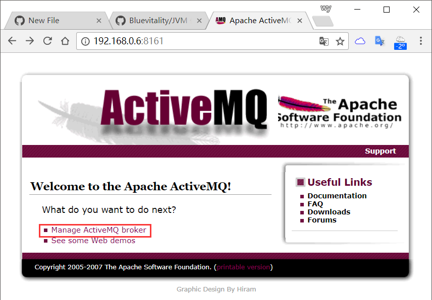
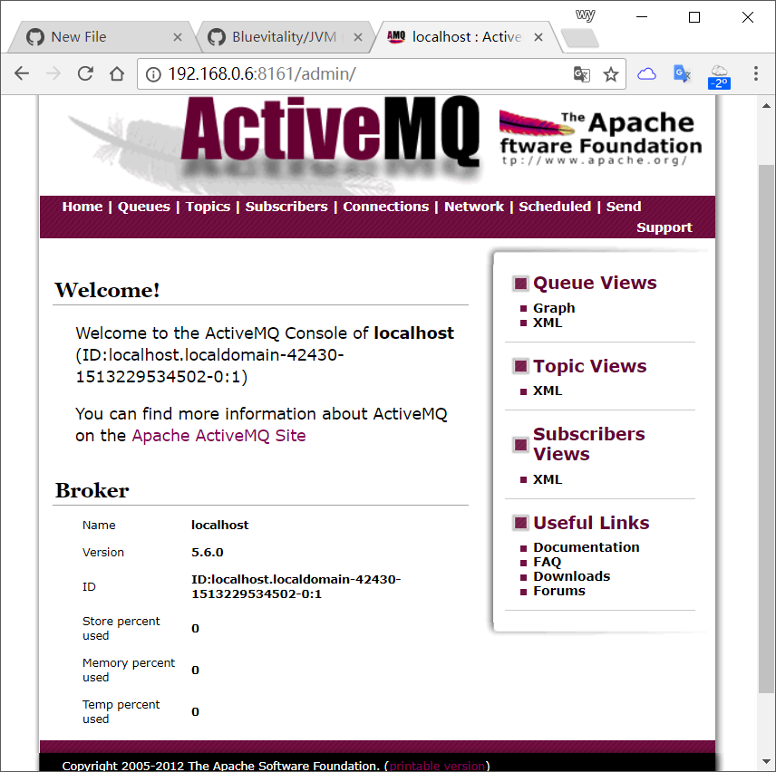
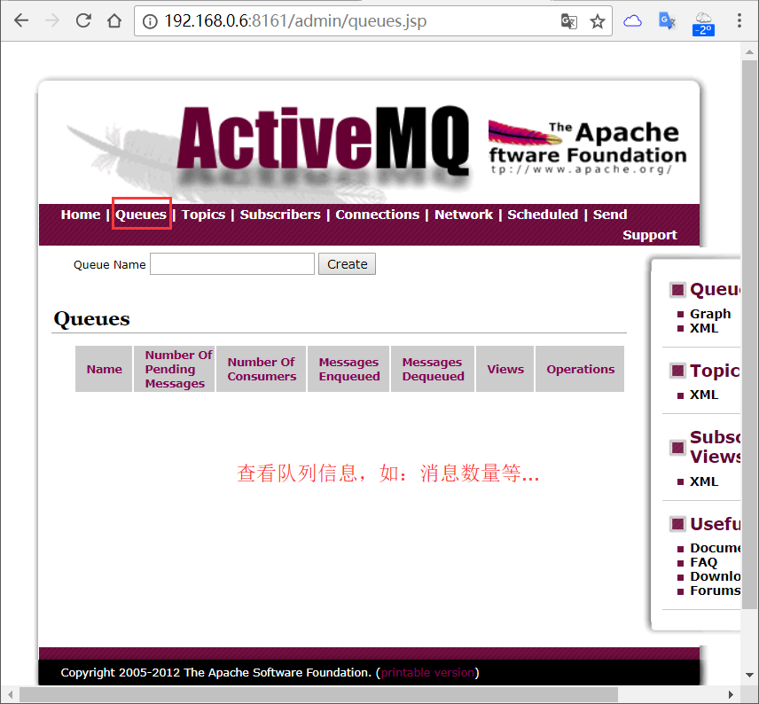

#### Install
```bash
# 一般情况下在安装前需事先安装JAVA环境 （不同的 ActiveMQ 版本对 JDK 版本有要求....） 这里使用二进制方式安装方式...
[root@localhost ~]# ll
总用量 47896
-rw-r--r--. 1 root root 49041409 12月 14 05:05 apache-activemq-5.6.0-bin.tar.gz
[root@localhost ~]# tar -zxf apache-activemq-5.6.0-bin.tar.gz -C /usr/local/
[root@localhost ~]# cd /usr/local/
[root@localhost local]# cd apache-activemq-5.6.0/
[root@localhost apache-activemq-5.6.0]# cd bin/
[root@localhost bin]# chmod 755 activemq                                        #赋予执行权限
[root@localhost ~]# cat /usr/local/apache-activemq-5.6.0/conf/activemq.xml      #主配置文件
[root@localhost bin]# grep "ACTIVEMQ_OPTS_MEMORY=" activemq                     #适当修改JVM的新生代和老年代大小
    ACTIVEMQ_OPTS_MEMORY="-Xms1G -Xmx1G"
[root@localhost ~]# /sbin/iptables -I INPUT -p tcp --dport 8161 -j ACCEPT       #WEB管理页面端口
[root@localhost ~]# /sbin/iptables -I INPUT -p tcp --dport 61616 -j ACCEPT      #默认的服务监听端口
[root@localhost ~]# /usr/local/pache-activemq-5.6.0/bin/activemq start &> /dev/null &    #启动....
INFO: Using default configuration
(you can configure options in one of these file: /etc/default/activemq /root/.activemqrc)

INFO: Invoke the following command to create a configuration file
/usr/local/apache-activemq-5.6.0/bin/activemq setup [ /etc/default/activemq | /root/.activemqrc ]

INFO: Using java '/usr/bin/java'
INFO: Starting - inspect logfiles specified in logging.properties and log4j.properties to get details
INFO: pidfile created : '/usr/local/apache-activemq-5.6.0/data/activemq-localhost.localdomain.pid' (pid '1461')
[root@localhost ~]# echo '/usr/local/pache-activemq-5.6.0/bin/activemq start &> /dev/null &' >> /etc/rc.local
[root@localhost ~]# chmod a+x /etc/rc.local
```
#### 主配置文件：/usr/local/apache-activemq-5.6.0/conf/activemq.xml 
```xml
<beans
  xmlns="http://www.springframework.org/schema/beans"
  xmlns:amq="http://activemq.apache.org/schema/core"
  xmlns:xsi="http://www.w3.org/2001/XMLSchema-instance"
  xsi:schemaLocation="http://www.springframework.org/schema/beans http://www.springframework.org/schema/beans/spring-beans-2.0.xsd
  http://activemq.apache.org/schema/core http://activemq.apache.org/schema/core/activemq-core.xsd">

    <!-- Allows us to use system properties as variables in this configuration file -->
    <bean class="org.springframework.beans.factory.config.PropertyPlaceholderConfigurer">
        <property name="locations">
            <value>file:${activemq.conf}/credentials.properties</value>
        </property>
    </bean>
    
    <broker xmlns="http://activemq.apache.org/schema/core" brokerName="localhost" dataDirectory="${activemq.data}">

        <destinationPolicy>
            <policyMap>
              <policyEntries>
                <!-- 关闭流控并设置消息队列的内存空间 -->
                <policyEntry topic=">" producerFlowControl="false" memoryLimit="512mb"> 
                  <pendingSubscriberPolicy>
                    <vmCursor />
                  </pendingSubscriberPolicy>
                </policyEntry>
                <policyEntry queue=">" producerFlowControl="true" memoryLimit="1mb">
                </policyEntry>
              </policyEntries>
            </policyMap>
        </destinationPolicy>

        <managementContext>
            <managementContext createConnector="false"/>
        </managementContext>

        <!-- 调整持久性存储策略 -- >
        <persistenceAdapter>    
            <kahaDB directory="${activemq.data}/kahadb"
            enableJournalDiskSyncs="false"
            indexWriteBatchSize="10000"
            indexCacheSize="1000"
            maxFileLength="1G"
            />       
        </persistenceAdapter>

        <!-- 设置内存阈值的限制 -->
        <systemUsage>
            <systemUsage>
                <memoryUsage>
                    <memoryUsage limit="64 mb"/> 
                </memoryUsage>
                <storeUsage>
                    <storeUsage limit="100 gb"/>
                </storeUsage>
                <tempUsage>
                    <tempUsage limit="50 gb"/>
                </tempUsage>
            </systemUsage>
        </systemUsage>

        <transportConnectors>
            <transportConnector name="openwire" uri="tcp://0.0.0.0:61616"/>     <!-- 服务监听的IP地址及端口 -->
        </transportConnectors>

    <!-- 在需要验证的场合新增账号密码 -->
    <plugins>
        <simpleAuthenticationPlugin>
            <users>
                <authenticationUser username="admin" password="manager" groups="users,admins"/>
            </users>
        </simpleAuthenticationPlugin>
    </plugins>
    </broker>
    
    <import resource="jetty.xml"/>
</beans> 
```
####




